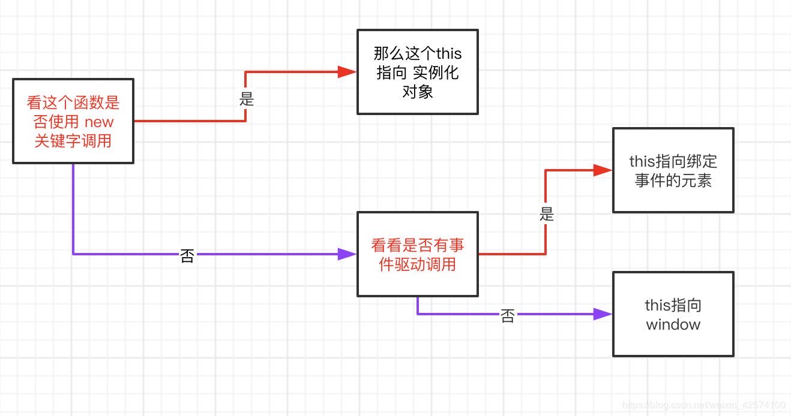

# this的指向问题  
 <!-- more-->
刚学习Javascript时，我常常会被this的指向搞蒙圈。我们知道this是Javascript函数中的一个关键字，也称之为this对象，那么这个对象表示什么呢，这个很重要，作为一名前端程序员，我们会经常使用到这个this，所以必须花点时间搞清楚这个this指向问题！之前看过这样一句话：*哪个对象调用函数，函数里面的this就指向哪个对象。* 这句话说得很有道理，下面是我学习时，总结的一些方便自己复习的知识点。

## 1.普通函数
**如果这个函数是普通函数，那么this的指向跟这个函数定义在什么位置没有关系，而是跟这个函数怎么调用有关系**

 在普通函数中，this指向可参考一下图片：

  

 ### 以下是案例：

 ```
    //这是一个普通函数
    function test(){
        console.log(this);
    }

    //1.使用new关键字调用
    var a1 = new test(); //test函数中的this指向a1这个实例对象

    //2.直接调用
    test(); //test函数中的this指向window
```
### 普通函数中this

（1）总是代表着它的直接调用者，如obj.fn，fn里的最外层this就是指向obj

（2）默认情况下，没有直接调用者，this指向window

（3）严格模式下（设置了'use strict'），this为undefined

（4）当使用call，apply，bind（ES5新增）绑定的，this指向绑定对象

## 2.ES6箭头函数

**如果这个函数是箭头函数，那么函数中的this指向就跟这个箭头函数定义在什么位置有关系。**

### 以下是案例：

```
  //这里是一个直接定义在window全局的箭头函数
   var test = () => {
        console.log(this);
    }

    //1.利用new来调用箭头函数
    //var b1 = new test(); //箭头函数不可以使用new来调用，会报错

    //2.直接调用
    test(); //test函数中的this指向window

```
  

```
   //这是一个函数写在函数中的案例
    var obj ={
        fn: ()=>{
            console.log(this);  
        }
    }
    obj.fn(); //this指向的是window
    
    //这是一个定时器案例
    btn.onclick=function(){
        setInterval(function() {
            console.log(this);//这里的this指向window
        }, 1000);
    }

    btn.onclick=function(){
        setInterval(() => {
            console.log(this);//这里的this指向btn这个元素
        }, 1000);
    }
```

### ES6箭头函数中this
**对于箭头函数来说，函数中的this跟调用没有关系，就看在哪定义，或者跟定义这个函数所处位置的this指向有关系**
（1）默认指向定义它时，所处上下文的对象的this指向。即ES6箭头函数里this的指向就是上下文里对象this指向，偶尔没有上下文对象，this就指向window 
（2）即使是call，apply，bind等方法也不能改变箭头函数this的指向


